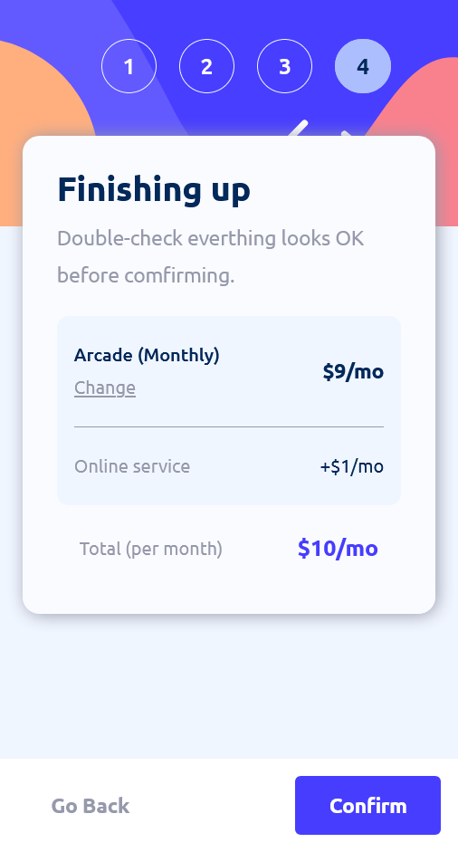

# Frontend Mentor - Solución de formulario de varios pasos

## Tabla de contenido

- [Frontend Mentor - Solución de formulario de varios pasos](#frontend-mentor---solución-de-formulario-de-varios-pasos)
  - [Tabla de contenido](#tabla-de-contenido)
  - [Descripción general](#descripción-general)
    - [El reto](#el-reto)
    - [Captura de pantalla](#captura-de-pantalla)
      - [Desktop](#desktop)
        - [Step 1 - Desktop](#step-1---desktop)
        - [Step 2 - Desktop](#step-2---desktop)
        - [Step 3 - Desktop](#step-3---desktop)
        - [Step 4 - Desktop](#step-4---desktop)
        - [Step 5 - Desktop](#step-5---desktop)
      - [Mobile](#mobile)
        - [Step 1 - Mobile](#step-1---mobile)
        - [Step 2 - Mobile](#step-2---mobile)
        - [Step 3 - Mobile](#step-3---mobile)
        - [Step 4 - Mobile](#step-4---mobile)
        - [Step 5 - Mobil](#step-5---mobil)
  - [Mi proceso](#mi-proceso)
    - [Construido con](#construido-con)
  - [Autor](#autor)

## Descripción general

### El reto

Los usuarios deben ser capaces de:

- Completa cada paso de la secuencia.
- Volver a un paso anterior para actualizar sus selecciones
- Ver un resumen de sus selecciones en el paso final y confirmar su pedido
- Ver el diseño óptimo para la interfaz según el tamaño de pantalla de su dispositivo
- Vea los estados de desplazamiento y enfoque para todos los elementos interactivos en la página
- Recibir mensajes de validación de formulario si:
    - Se ha perdido un campo
    - La dirección de correo electrónico no tiene el formato correcto
    - Se envía un paso, pero no se ha realizado ninguna selección.

### Captura de pantalla

#### Desktop

##### Step 1 - Desktop

##### Step 2 - Desktop

##### Step 3 - Desktop

##### Step 4 - Desktop

##### Step 5 - Desktop

#### Mobile
##### Step 1 - Mobile

##### Step 2 - Mobile

##### Step 3 - Mobile

##### Step 4 - Mobile

##### Step 5 - Mobil

## Mi proceso

### Construido con

- Marcado HTML5 semántico
- Sass
- Flexbox
- Cuadrícula CSS
- Flujo de trabajo desktop primero

## Autor

- Sitio web - [Agregue su nombre aquí] (https://www.your-site.com)
- Mentor de frontend - [@tunombredeusuario](https://www.frontendmentor.io/profile/tunombredeusuario)
- Twitter - [@tunombredeusuario](https://www.twitter.com/tunombredeusuario)
